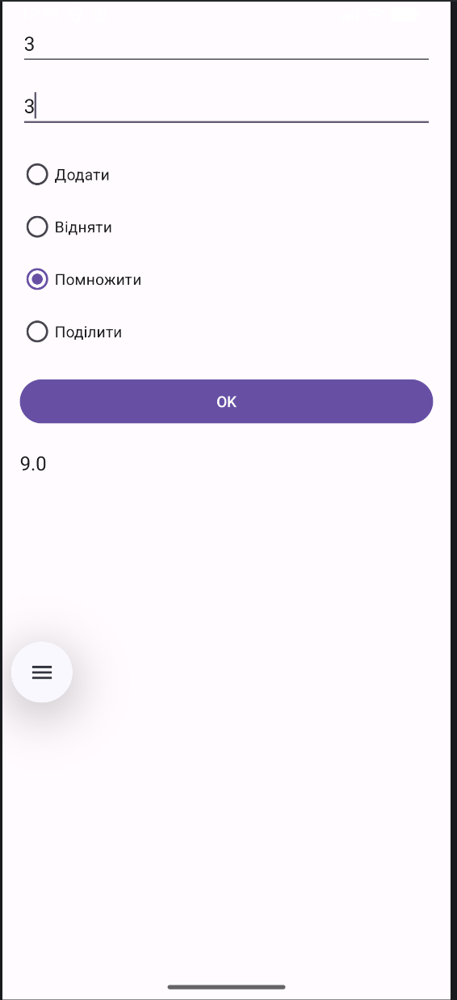

# Lab 1

# Мета роботи
Ознайомитися з основами розробки Android-додатків та створенням простого користувацького інтерфейсу.

# Завдання
Розробити Android-додаток, який:
- дозволяє вводити два числа
- обирати арифметичну операцію
- відображає результат обчислення

# Опис роботи
У ході виконання лабораторної роботи було створено мобільний додаток з одним Activity, який містить два поля введення чисел (EditText), групу перемикачів (RadioGroup) для вибору математичної операції (додавання, віднімання, множення або ділення), кнопку «OK» для виконання обчислення, а також текстове поле для відображення отриманого результату.

# Реалізовано перевірку:
- на заповненість полів
- на ділення на нуль

# Висновок

У результаті виконання лабораторної роботи було освоєно створення простого користувацького інтерфейсу в середовищі Android Studio, роботу з Activity, обробку подій, зокрема натискання кнопок, а також реалізацію базової логіки обчислень у мобільному застосунку.

