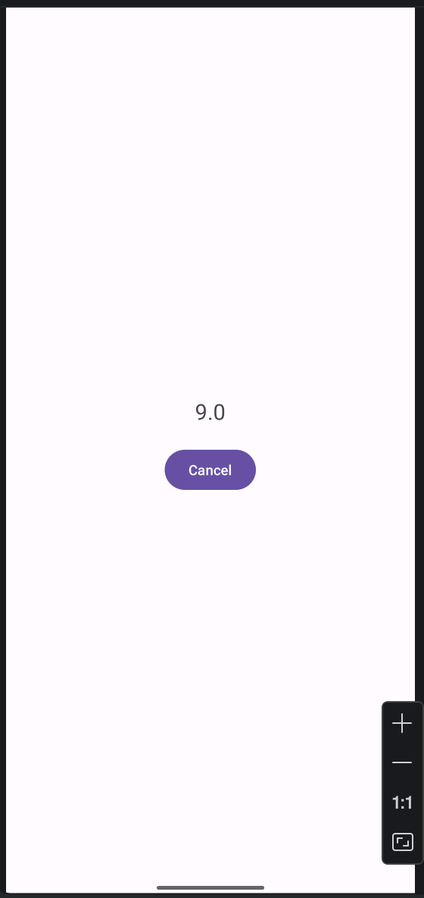

# Лабораторна робота № 2. Дослідження роботи з компонентом Fragment

## Мета роботи
Дослідити створення та взаємодію з компонентом Fragment та навчитися використовувати кілька фрагментів в одному Activity.

## Завдання
Розробити Android-додаток, який:
- складається з двох фрагментів
- перший фрагмент — введення даних
- другий фрагмент — відображення результату
- забезпечує взаємодію між фрагментами

## Опис роботи
У ході виконання лабораторної роботи було реалізовано мобільний додаток, що складається з одного Activity та двох фрагментів: InputFragment і ResultFragment. У фрагменті InputFragment забезпечено введення двох чисел, вибір математичної операції (додавання, віднімання, множення або ділення), а також кнопку «OK» для виконання обчислення. У фрагменті ResultFragment реалізовано відображення отриманого результату та кнопку «Cancel» для повернення до попереднього екрану. Крім того, у додатку було реалізовано передачу даних між фрагментами за допомогою інтерфейсів, перевірку коректності введених даних, а також обробку можливих помилок, зокрема ділення на нуль.

## Висновок
У процесі виконання лабораторної роботи було вивчено створення та використання фрагментів (Fragment), організацію взаємодії між Activity та Fragment, передачу даних між компонентами додатку, а також управління фрагментами за допомогою FragmentManager.

