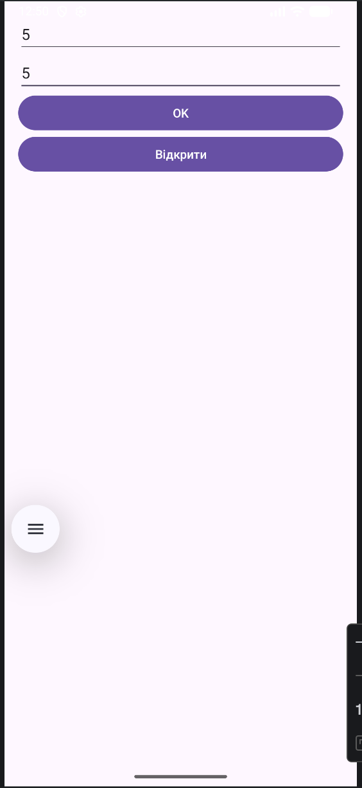

# Лабораторна робота № 3. Дослідження способів збереження даних

## Мета роботи
Ознайомитися з роботою зі сховищами даних в Android та навчитися зберігати і відображати інформацію.

## Завдання
Модифікувати програму з лабораторної роботи №2, додавши:
- збереження результатів у сховище (файл або база даних)
- повідомлення користувача про успішний запис
- кнопку "Відкрити" для перегляду збережених даних

## Опис роботи
У ході виконання лабораторної роботи було розширено функціональність додатку, створеного на основі попередньої лабораторної. При натисканні кнопки «OK» виконується обчислення, після чого отриманий результат зберігається у файл у внутрішньому сховищі пристрою, а користувач отримує повідомлення про успішний запис. Також було додано кнопку «Відкрити», яка відкриває нову Activity, де відображаються збережені результати. У випадку відсутності даних у сховищі виводиться відповідне повідомлення про його порожність. Додатково передбачено можливість очищення збережених даних.

## Висновок
У результаті виконання лабораторної роботи було вивчено роботу зі сховищами даних в Android, реалізовано механізми запису та читання даних, а також освоєно перехід між різними Activity у межах одного додатку.

