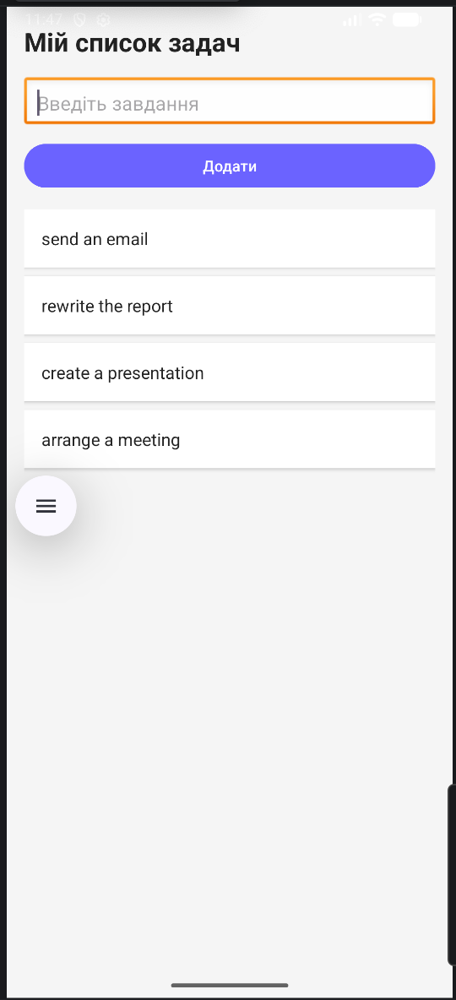

# Лабораторна робота № 6. Вільна тема

## Мета роботи

Ознайомитися з процесом створення Android-додатку з використанням інтерфейсу користувача, обробки подій та роботи зі списками даних, а також закріпити навички розробки власного проєкту на довільну тему.

## Завдання

Розробити Android-додаток, який дозволяє користувачу вводити текст задачі, додавати задачу до списку, відображати список задач, видаляти задачу натисканням, а також забезпечити зручний та сучасний інтерфейс користувача.

## Опис роботи

У ході виконання лабораторної роботи було створено Android-додаток для роботи зі списком задач (To-Do List). Інтерфейс користувача реалізовано за допомогою LinearLayout і включає заголовок додатку, поле введення (EditText), кнопку додавання (Button) та список задач (ListView). Для покращення вигляду було створено окремий layout для елементів списку (item_task.xml), що дозволяє відображати задачі у вигляді карток. Логіка роботи додатку базується на використанні списку ArrayList<String> для збереження задач та ArrayAdapter для їх відображення. При натисканні кнопки введений текст додається до списку, після чого список оновлюється, а поле введення очищується. При натисканні на елемент списку відповідна задача видаляється. Для покращення зовнішнього вигляду використано власні кольори (colors.xml), відступи, стилізацію кнопок та картковий стиль елементів списку.

## Висновок

У ході виконання лабораторної роботи було отримано практичні навички створення Android-додатків, роботи з інтерфейсом користувача, обробки подій та використання списків даних. Розроблений додаток демонструє базові можливості створення інтерактивних програм на платформі Android.

